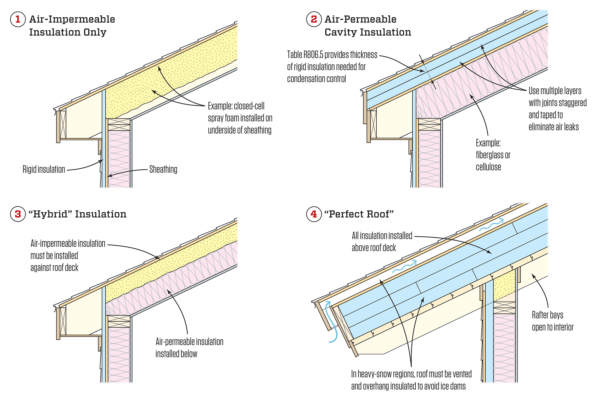

# Dream-Home-wizards-tower

The overall idea of the house, is that it was built by a typical fantasy wizard
several millenia ago, and then lost after he passed away. I found it and
renovated it while keeping the original character of the house (quirky and
natural)

Want to use natural materials as much as possible (wood and stone) while still
keeping high energy efficiency.

## Repository Notes

rezip.py is from [costerwi/rezip](https://github.com/costerwi/rezip) and is
used to uncompress the freecad files so they work with git better. It is copied
into the repo itself for ease of use. The post processing is done using .gitattributes

## TODO

-   redo third and potentially second floor to get rid of all around walkway and move bathroom towards atrium.
-   Reimplement tracked elevator blocking walls in Revit
-   work on lighting design more
-   ~~rethink layer heights and levels, especially in terms of ceilings and floors.~~
-   rethink basement, maybe shrink down, but keep in mind space for mechanical systems.
-   add lighting pipes at ceiling level on all floors around perimeter of cutout
-   add in ceiling, 6" *dropped* ceiling with dark wood panels at least on ground floor.
-   ~~think about combining floor 3 and 4 into library/lounge~~ and adding windows
or shrinking overall footprint to allow for greater height.
-   Add demand column and total column for electrical calcs amperage
-   Sink living room area into floor.
-   Standardize subtotals row and implement if statement for total amps cell
-   How to integrate plants/planters into ground floor. Want feeling of being in jungle.
-   Add custom wooden suspended ceilings over certain areas on ground floor,
dining and living room, have them on tracks so they can be moved around. Use light
source mini can LED lights in suspended ceiling. want to not have "grid" look,
potentially have uplights/indirect light either shining through boards, or
bouncing off ceiling
-   add more windows, especially to bathrooms
-   ~~North is oriented towards elevator~~
-   ~~move entrance to south west side~~
-   add patio along east side of house
-   ~~add more windows into east wall of house~~
-   ~~put workshop area by elevator and combine half of -1 and -2 to give more ceiling height.~~
-   ~~change wall doors to tracked style~~
-   On floors 1 and 2, have hallway on outside with interior windows in bedrooms
-   flow meters on io of water loops for leak detection

## Floor space planning

Area of circle 𝜋R²

-   Ground floor is 18' radius ==> 1,017.87 ft²
-   First floor is 17'3" radius w/ 6' radius hole ==> 821.7 ft²
-   Second floor is 16'6" radius w/ 6' radius hole ==> 742.2 ft²
-   Third floor is 15'3" radius w/ 6' radius hole ==> 617.5 ft²
-   Fourth floor is 15' radius w/ 6' radius hole ==> 593.8 ft²

Total floorspace 3793 sq ft

## Load planning

loads from roof level:

-	Steel 22 Gauge standing seam conical roof
-	Maintance catwalk constructed of steel with open grate composite floor with exterior railing designed to support communication antennas and lighting fixtures. Use live and dead load estimates from theatrical catwalks.
- 4 pick points for 2 ton hoists in central atrium area on underside of beams (want at least a 3x safety factor for each pick point)

## General Description

### Code notes/references

#### IBC/IRC

Using IRC/IBC 2018 codes, house probably doesn't fall under the IRC due to the
use of heavy timber and concrete construction. The IRC has specific
construction styles that it covers, and in the 2018 codes, it primarily covers
balloon/platform framing.

Based on this, the house would fall under R-3 residential occupancy.
Quoting the code: "Section 310.4 Residential Group R-3. Buildings that do
not contain more than two dwelling units"

Section 405 doesn't apply due to exception 1 of 405.1, since the building
is sprinklered per &sect;903.3.1.3

section 420.2 separation walls may apply

max height (table 504.3) and max stories (table 504.4) for HT construction
in R occupancies is 60 ft (R3 stories 4) with sprinklers according to
&sect;903.3.1.2 or &sect;903.3.1.3 , and 85 ft with sprinklers according to &sect;903.3.1.1
(R3 stories 5). All new R occupancies must be sprinklered.

Section 505.3 Equipment platforms are not considered a story or part of the
story below. they do not contirbute to building area or number of stories.

May need an exception to Section 712.1.2 unless floors 3 and 4 can count as one story or floor 4 can count as a mezzanine.

&sect;705.8.5 vertical separation of openings. Windows have to be seperated vertically not less than 3ft, unless building is sprinklered with regards to &sect;903.3.1.1 or &sect;903.3.1.2

&sect;705.10 ducts and air transfer openings have to be protected if they are in fire resistance rated exterior walls. &sect;717 may also apply.

**equipment shafts**:

section 713 

need 2 hour fire rating (&sect;713.4) on enclosing walls (penetrates 4 or more floors), as well as top if shaft does not extend to roof and bottom if shaft does not extend to bottom of building.

will need fire rated ceiling, since it will not extend past floor 3. Will extend to bottom of building and terminate in electrical room, which needs the same 2hr fire rated construction as the shaft.

Will need at least 1.5 hr fire rated doors in shaft openings (table 716.1(2))

table 721.1(2) has fire resistance ratings for walls and partitions of various materials

&sect;713.6 shaft walls that are also exterior walls should comply with sections of 705 that apply to exterior walls.

this won't affect the house, since the exterior walls will be much thicker than required for a 2 hr fire rating.

&sect;717 ducts that penetrate shaft walls may require fire dampers. May want to put ventilation ducting not inside mechanical shaft (or not have a mechanical shaft at all)

&sect;803.15 will apply to any false/dropped ceilings, and any interior finishes attached to the concrete walls (stone etc) except for paint.

**sprinkler systems**

&sect;903.2 exception: server rooms, battery rooms and telecom closets don't need sprinklers if they are provided with smoke detection and separted by at least 1 hr fire barriers from other spaces.

&sect;903.2.8.1 R3 occupancies need sprinkler systems but they may comply with 903.3.1.3

903.3.1.1 is NFPA 13 sprinkler systems

903.3.1.2 is NFPA 13R sprinkler systems

903.3.1.3 is NFPA 13D sprinkler system

May have to install standpipe based on &sect;905.3 and AHJ requirements

&sect;907.2.22 need smoke detection in battery rooms

table 1404.2 - natural stone on exterior wall needs to be 2" thick

&sect; 1505 - type 4 (HT) construction requires minimum class B roof. Slate roof installed on ASTM D226 type 2 asphalt felt #30 felt is class A, as is standing seam metal roof installed on noncombustible deck, or without roof deck on noncombustible framing.

**Can't walk on slate roofs**

slate roof should have deflection of 1/720, any other roof needs 1/360

Table 1604.5 - This structure is risk category II

Table 1607.1 Live loads - includes info about catwalks.

&sect;1607.14 Crane Loads - Using this for the hoist loads. Live load is the rated capacity.

#### IECC

Since the house is 4 stories, the commercial provisions of the IECC apply.

Park County is in zone 7

Minimum requirements for opaque thermal envelope insulation components based on Table C402.1.3. Zone 7 Group R numbers as follows: 

Insulation entirely above roof deck needs R-35 continuous insulation
Mass walls need minimum R15.2 of continuous insulation.
Below grade walls need minimum R10 of continuous insulation.
Mass floors need minimum R16.7 continuous insulation
joist/framing floors need minimum R30 insulation

### Construction notes

#### Roof

Conical roof.

Standing seam metal roofing with layers as follows. See  for more info. From [JLC](https://www.jlconline.com/how-to/insulation/avoiding-wet-roofs-part-ii_o)

-	metal roof panels

-	Underlayment

-	Sheathing

-	2x4 spacers oriented vertically (16" on center)
	This creates an air gap for venting the underside of the sheathing.

-	Sheathing

-	Mineral Wool board insulation - Comfortboard 110

-	Air sealing - spray foam (maybe)

-	Sheathing/ceiling support (may be ceiling material as well)

-	Ceiling material (Optional)

-	Joists

-	Ceiling material (Optional)

Insulation and sheathing sandwitch extends out into overhang over joists.
There is a nailer/support around the entire perimeter of the roof, which has the trim over it. The trim is the same material as the metal roof panels.

The vent channel has a fascia board protecting it, with a metal drip edge over it. There is an internal mesh screen in the vent opening.

will need point ridge vent on top.

Catwalk installed over roof using standing seam clamps <https://s-5.com/products/utility-solutions/walkways/> and non metallic walkway boards.

Heavy timber framing for roof, probably 8 main joists.

### General notes

House is sited so that the elevator shaft is facing north. The elevator shaft
is embedded in a hill with the majority of the house with southern exposure.

general style is a combination between medieval and modern. Lots of slate and
wood, but open plan layouts and not a lot of walls. Medieval simplicity, with
less of hogwarts ornateness on the interior. Old tower - new interior.

HVAC is 4 pipe system with localized ZCUs + zoned radiant heat, as well as a
global air recirculation/filtration/humidification system. Also allows for
adding local components to HVAC loop such as water cooled computers or mini
ZCUs. Windows are also interconnected into the HVAC system so that automatic
natural heating/cooling can happen as well.

Lots of greenery and hanging plants/vines on walls. Some used for partitions.

Bathrooms on outside of house have windows

## Lighting stuff

Primary illumination on ground floor is provided by
[WL 72º RGBW LED](https://www.thelightsource.com/products/wl-series-led-fixture-109)
fixtures (12 per 20A 120V circuit)

Secondary illumination in center of ground floor provided by either
[RD 72º RGBW LED](https://www.thelightsource.com/products/rd-series-led-fixtures-137) or
[WL 72º RGBW LED](https://www.thelightsource.com/products/wl-series-led-fixture-109)
fixtures (12 per 20A 120V circuit)

Additional RGBW tape under the lip of the stairs/RGBW led spots mounted on the
wire of the railings.

For other floors and providing additional illumination on ground floor (or
replacing the above depending on cost), are custom built RGBAW led fixtures.
These contain an arduino and sensors and use POE for data and power. Sensors
include:

-   Thermal (wet and dry bulb)
-   humidity
-   air quality (co2, o2, co, other polutants and gasses, ideally a wide spectrum sensor)
-   presence detection (Ultrasonic, infrared, radar)
-   light levels

They might also contain additional connections for switches or door/window
position sensors.

## General Technology

-   in wall vacuum system

### Radio

-   UHF commerical MotoTrbo repeater
-   2M + 70cm + 1.25M amateur repeaters

-   HF radio

## Network Planning

Datacenter in basement. Dual pfSense routers in failover mode. At least two
different fiber lines from different carriers, as well as a satelite link.

Central fiber trunk runs up in mechanical space near kitchen, with at least one
POE managed switch on each floor.

Distribution cable is carried in trays that run in the beam interstitial space.

Each light switch and custom light needs a POE network port. Also every universe
of DMX needs a network port.

## Outlet planning

each "room" needs a lighting outlet which will be manually switched with remote
control posibilities. This will be used for an LED floodlight as a backup and to
satisfy NEC requirements.

2-3 additional lighting circuits per floor

### Ground floor

2 lighting circuits in ceiling for WL lights, at least 2 more circuits in
ceiling for other stuff like powered speakers, etc.

Bathroom outlet and lighting circuit

## Appliances

### Commerical Option
-   Hobart LXeR dishwasher
-   Hobart HEC5D convection oven

### Residential Option

-   GE Café French Door Convection Wall Oven

## Ground floor

Ground floor is open plan kitchen/living room/dining room. Living room is at the
base of the central atrium and is sunken about 1 foot to create a space
deliniation. The kitchen has a different flooring material with no seams to
allow for easy cleaning. The rest of the flooring is large slate tiles, ideally
with irregular joints to look more like a flagstone floor but with the joints
sealed against moisture and to allow for easy sweeping.

Living room has a rug, along with couches and a coffee table.

all furniture/appliances are on casters to allow for flexibility, with plug and
cord connected appliances and electronics connected to plugs in the ceiling.

Kitchen is industrial and all electric.

Free space can be utilized for workspace if needed

Has powder room.

## Floor 1

Master bedroom and office, potentially small powder room depending on
convenience of floor 2 bathroom

## Floor 2

Living room, a little more medieval/comfortable with chairs and sofas, large
bathroom to serve first and third floors, potentially part of library

## Floor 3

library, observatory. Has wall mounted bookshelves and reading tables/chairs.

Also has the power and data connections for the truss equipment and any other
cord/hose drops in the center of the house.

## Floor 4

This has a walkway around the edge in order to get to the second tier of
shelving.

potentially have a loft or catwalk in the middle of the room over the beams for
the hoist motors.

## Floor -1

Has a guest suite as well as a workshop, home theatre and storage.

## Floor -2

Has datacenter and electrical distribution gear + storage. Workshop may extend
to this floor.

## Floor -3

Has HVAC equipment (chillers, boilers, heat pumps etc) for both the house and
the datacenter. Also has any potential water/sewage treatment and storage
equipment. (gray water, well, septic etc, rain water catchment, etc)
